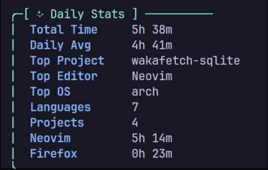
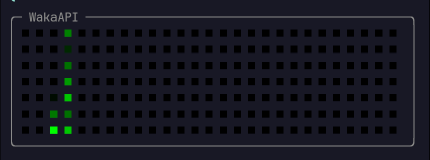

# WakaAPI CLI Dashboard (Sqlite Based For Local Only)

A terminal-based CLI dashboard that fetches coding activity metrics directly from the **WakaAPI SQLite database**.
This is a **personal project** created to provide a lightweight, customizable, and colorful CLI interface for viewing coding statistics like total time, daily averages, top editors, projects, and more.

---

## Notes

- Direct SQLite reads may show slightly stale data if WakaAPI is actively running due to in-memory caching. Restarting the service or querying after a few seconds ensures accurate values.
- This project is **personal** and meant for experimentation with terminal dashboards and SQLite queries.
- Colors and formatting can be easily customized in the code using `github.com/fatih/color`.

---
